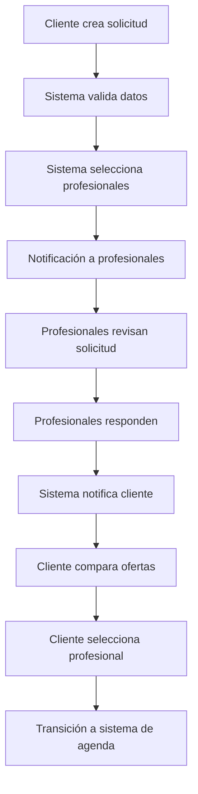

# Análisis Funcional Profundo - Sistema de Solicitud de Presupuestos CHANGANET

## 1. Introducción

Este documento presenta el análisis funcional completo del módulo de Solicitud de Presupuestos para la plataforma CHANGANET, basado en los requerimientos REQ-31 a REQ-35 del PRD.

## 2. Análisis de Requerimientos Funcionales

### 2.1 REQ-31: Creación de Solicitud por Cliente
**Descripción**: El cliente debe poder crear una solicitud con descripción y fotos.

**Análisis Funcional**:
- **Actor Principal**: Cliente
- **Precondiciones**: Cliente autenticado, profesionales disponibles
- **Flujo Principal**:
  1. Cliente accede al módulo de solicitud de presupuesto
  2. Completa descripción detallada del servicio requerido
  3. Adjunta fotos del trabajo a realizar (máximo 5 fotos)
  4. Selecciona la categoría del servicio
  5. Opcional: Define fecha deseada para el servicio
  6. Guarda la solicitud como "borrador" o "envía inmediatamente"

**Reglas de Negocio**:
- La descripción debe tener mínimo 50 caracteres
- Máximo 5 fotos, formato JPG/PNG, tamaño máximo 5MB cada una
- La solicitud debe estar relacionada con una categoría de servicio existente
- El cliente puede tener máximo 10 solicitudes activas simultáneamente

**Validaciones**:
- Verificar autenticación del usuario
- Validar contenido del texto (sin contenido ofensivo)
- Validar formato y tamaño de imágenes
- Verificar límites de solicitudes activas

### 2.2 REQ-32: Distribución a Profesionales Preseleccionados
**Descripción**: El sistema debe enviar la solicitud a varios profesionales preseleccionados.

**Análisis Funcional**:
- **Actor Principal**: Sistema (automatizado)
- **Flujo Principal**:
  1. Sistema evalúa profesionales elegibles basados en:
     - Especialidad coincidente
     - Ubicación geográfica (radio máximo 25km)
     - Disponibilidad declarada
     - Calificación mínima 4.0
     - Estado activo
  2. Sistema envía notificaciones a profesionales seleccionados
  3. Sistema crea registros en tabla de distribución
  4. Sistema actualiza estado de solicitud a "distribuida"

**Reglas de Negocio**:
- Se envían máximo 10 solicitudes por solicitud original
- Los profesionales deben estar verificados
- Radio máximo de distancia configurable
- Tiempo límite de respuesta: 48 horas

**Algoritmo de Selección**:
```
1. Filtrar por especialidad = categoría solicitada
2. Filtrar por distancia <= 25km del cliente
3. Filtrar por disponibilidad = disponible
4. Filtrar por calificación >= 4.0
5. Ordenar por: calificación desc, distancia asc, disponibilidad
6. Seleccionar top 10
```

### 2.3 REQ-33: Respuesta de Profesionales con Presupuesto
**Descripción**: Los profesionales deben poder responder con precio y comentarios.

**Análisis Funcional**:
- **Actor Principal**: Profesional
- **Precondiciones**: Profesional autenticado, solicitud recibida, estado "distribuida"
- **Flujo Principal**:
  1. Profesional accede a bandeja de entrada
  2. Revisa detalles de la solicitud
  3. Completa formulario de presupuesto:
     - Precio total (obligatorio)
     - Tiempo estimado (días)
     - Comentarios adicionales
     - Opcional: fotos de trabajos similares
  4. Envía respuesta

**Reglas de Negocio**:
- Solo una respuesta por profesional por solicitud
- Precio debe estar dentro del rango razonable para el servicio
- Comentarios máx 500 caracteres
- Tiempo estimado debe ser realista

**Validaciones**:
- Verificar que el profesional fue seleccionado para esta solicitud
- Validar formato del precio (decimal positivo)
- Verificar tiempo estimado (1-30 días)
- Prevenir envío duplicado

### 2.4 REQ-34: Vista Comparativa de Ofertas
**Descripción**: El cliente debe poder comparar ofertas en una vista única.

**Análisis Funcional**:
- **Actor Principal**: Cliente
- **Precondiciones**: Solicitud con al menos una respuesta
- **Flujo Principal**:
  1. Cliente accede a vista de comparación
  2. Sistema presenta tabla comparativa con:
     - Información del profesional (foto, nombre, calificación)
     - Precio total
     - Tiempo estimado
     - Comentarios
     - Fotos (si las hay)
  3. Cliente puede filtrar y ordenar:
     - Por precio (ascendente/descendente)
     - Por tiempo (más rápido/lento)
     - Por calificación
  4. Cliente puede seleccionar oferta favorita

**Características de la Vista**:
- **Tabla Responsive**: Adaptable a móvil y desktop
- **Indicadores Visuales**: Badge "Mejor Precio", "Más Rápido"
- **Información Detallada**: Popover con detalles completos
- **Historial**: Acceso a trabajos anteriores del profesional

**Funcionalidades Adicionales**:
- Marcar ofertas como "favoritas"
- Solicitar aclaraciones vía chat
- Ver perfil completo del profesional
- Comparar ofertas lado a lado

### 2.5 REQ-35: Notificaciones al Cliente
**Descripción**: El sistema debe notificar al cliente cuando reciba una oferta.

**Análisis Funcional**:
- **Actor Principal**: Sistema (automatizado)
- **Flujo Principal**:
  1. Sistema detecta nueva oferta recibida
  2. Envía notificación inmediata:
     - Push notification al cliente
     - Email con resumen de la oferta
     - Notificación en la plataforma
  3. Cliente puede acceder directamente desde la notificación
  4. Sistema registra el envío de notificaciones

**Tipos de Notificación**:
- **Push Notification**: "Nueva oferta recibida para tu solicitud de [servicio]"
- **Email**: Detalles completos de la nueva oferta
- **In-App**: Banner de notificación en dashboard del cliente

**Reglas de Negocio**:
- Notificación inmediata (máximo 1 minuto de delay)
- Permitir configurar preferencias de notificación
- Consolidar múltiples ofertas en una sola notificación

## 3. Flujo Completo del Negocio

### 3.1 Diagrama de Flujo Principal



### 3.2 Estados del Sistema

- **Borrador**: Solicitud creada pero no enviada
- **Enviada**: Solicitud creada y enviada por el cliente
- **Distribuida**: Solicitud enviada a profesionales
- **Respondiendo**: Profesionales enviando sus ofertas
- **Cerrada**: Cliente seleccionó una oferta o venció el tiempo límite
- **Expirada**: Venció el tiempo límite sin respuestas

## 4. Reglas de Negocio Adicionales

### 4.1 Gestión de Tiempo
- **Tiempo de vida de solicitud**: 7 días
- **Tiempo de respuesta profesional**: 48 horas
- **Recordatorio automático**: A las 24h para profesionales sin respuesta

### 4.2 Límites y Cuotas
- Cliente: Máximo 10 solicitudes activas
- Profesional: Máximo 20 respuestas por día
- Sistema: Procesar máximo 1000 solicitudes por hora

### 4.3 Criterios de Calidad
- Solo profesionales con calificación >= 4.0
- Verificación de identidad obligatoria
- Historial mínimo de 5 trabajos completados

### 4.4 Excepciones
- Servicios de emergencia (tiempo de respuesta 2 horas)
- Servicios premium (selección manual de profesionales)
- Servicios con presupuesto alto (>$10,000) requieren supervisor

## 5. Integración con Otros Módulos

### 5.1 Sistema de Perfiles Profesionales
- Obtener información del profesional (calificación, ubicación, especialidades)
- Validar estado del perfil (activo, verificado)

### 5.2 Sistema de Mensajería Interna
- Chat directo cliente-profesional durante comparación
- Notificaciones de mensajes

### 5.3 Sistema de Disponibilidad y Agenda
- Transición automática cuando cliente selecciona oferta
- Verificación de disponibilidad antes de agendar

### 5.4 Sistema de Notificaciones
- Push notifications
- Emails automatizados
- Notificaciones in-app

### 5.5 Sistema de Pagos (Futuro)
- Anticipo para servicios de alto valor
- Escrow para montos significativos

## 6. Métricas y KPIs

### 6.1 Métricas de Cliente
- Tiempo promedio de respuesta de profesionales
- Número promedio de ofertas recibidas
- Tasa de selección de oferta
- Tiempo promedio desde solicitud hasta selección

### 6.2 Métricas de Profesional
- Tasa de respuesta a solicitudes
- Tiempo promedio de respuesta
- Tasa de selección como profesional elegido
- Valor promedio de ofertas enviadas

### 6.3 Métricas de Negocio
- Tasa de conversión solicitud → contratación
- Satisfacción del cliente
- Valor promedio del contrato
- Tiempo promedio del ciclo completo

## 7. Riesgos Identificados

### 7.1 Riesgos Técnicos
- Sobrecarga del sistema con múltiples solicitudes simultáneas
- Fallas en el envío de notificaciones
- Pérdida de fotos durante el upload

### 7.2 Riesgos de Negocio
- Profesionales no responden (baja tasa de respuesta)
- Guerra de precios entre profesionales
- Clientes spam con solicitudes falsas

### 7.3 Riesgos de UX
- Proceso muy complejo para usuarios no técnicos
- Interfaz confusa en la vista de comparación
- Delay en notificaciones affecting user experience

## 8. Medidas de Mitigación

### 8.1 Técnicas
- Sistema de colas para procesamiento asíncrono
- Retry automático para notificaciones fallidas
- Backup automático para imágenes

### 8.2 De Negocio
- Sistema de penalizaciones por no responder
- Validación de identidad más estricta
- Límites diarios por usuario

### 8.3 De UX
- Interfaz progresiva con tooltips
- Simplificación del flujo de comparación
- Notificaciones en tiempo real con WebSockets

## 9. Conclusiones y Recomendaciones

### 9.1 Prioridades de Implementación
1. **Alta**: REQ-31, REQ-32, REQ-33 (funcionalidad básica)
2. **Media**: REQ-34 (interfaz de usuario)
3. **Baja**: REQ-35 (notificaciones)

### 9.2 Consideraciones Técnicas
- Usar PostgreSQL para manejo de datos geoespaciales
- Implementar cache Redis para cálculos frecuentes
- Usar WebSockets para notificaciones en tiempo real

### 9.3 Próximos Pasos
- Diseñar esquema de base de datos
- Definir APIs específicas
- Crear prototipos de interfaz de usuario
- Implementar sistema de pruebas automatizadas

---

*Documento generado para CHANGANET - Plataforma Digital de Servicios Profesionales*
*Fecha: 25 de Noviembre de 2025*