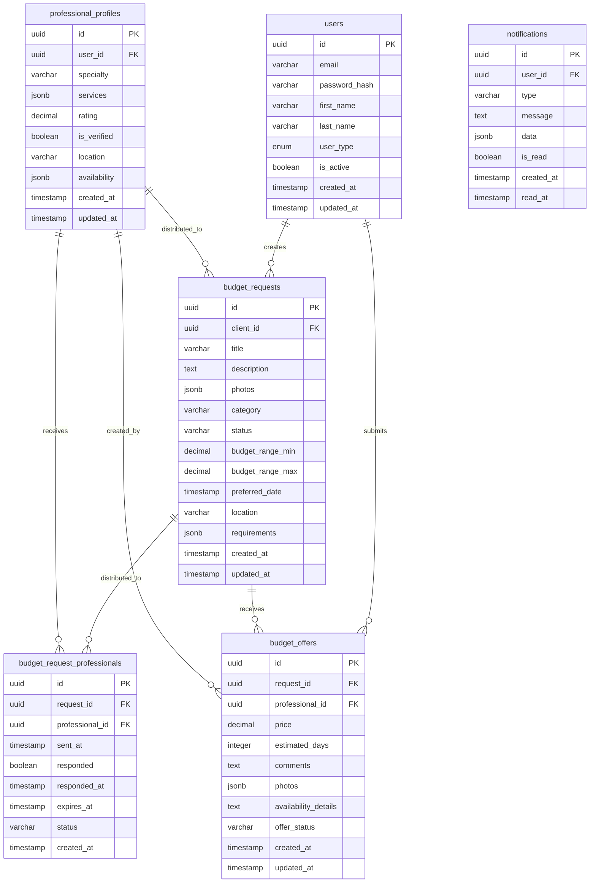

# Diseño de Base de Datos - Sistema de Solicitud de Presupuestos CHANGANET

## 1. Esquema General

### 1.1 Diagrama de Entidad-Relación



## 2. Definición de Tablas

### 2.1 Tabla: budget_requests

```sql
CREATE TABLE budget_requests (
    id UUID PRIMARY KEY DEFAULT gen_random_uuid(),
    client_id UUID NOT NULL REFERENCES users(id) ON DELETE CASCADE,
    title VARCHAR(255) NOT NULL,
    description TEXT NOT NULL,
    photos JSONB DEFAULT '[]',
    category VARCHAR(100) NOT NULL,
    status VARCHAR(20) DEFAULT 'draft' CHECK (status IN ('draft', 'sent', 'distributed', 'responding', 'closed', 'expired')),
    budget_range_min DECIMAL(10,2),
    budget_range_max DECIMAL(10,2),
    preferred_date TIMESTAMP,
    location JSONB,
    requirements JSONB DEFAULT '{}',
    total_offers INTEGER DEFAULT 0,
    selected_offer_id UUID,
    created_at TIMESTAMP DEFAULT CURRENT_TIMESTAMP,
    updated_at TIMESTAMP DEFAULT CURRENT_TIMESTAMP
);

-- Índices
CREATE INDEX idx_budget_requests_client_id ON budget_requests(client_id);
CREATE INDEX idx_budget_requests_status ON budget_requests(status);
CREATE INDEX idx_budget_requests_category ON budget_requests(category);
CREATE INDEX idx_budget_requests_created_at ON budget_requests(created_at);
CREATE INDEX idx_budget_requests_location ON budget_requests USING GIN(location);

-- Trigger para actualizar updated_at
CREATE OR REPLACE FUNCTION update_updated_at_column()
RETURNS TRIGGER AS $$
BEGIN
    NEW.updated_at = CURRENT_TIMESTAMP;
    RETURN NEW;
END;
$$ language 'plpgsql';

CREATE TRIGGER update_budget_requests_updated_at 
    BEFORE UPDATE ON budget_requests 
    FOR EACH ROW 
    EXECUTE FUNCTION update_updated_at_column();
```

### 2.2 Tabla: budget_request_professionals

```sql
CREATE TABLE budget_request_professionals (
    id UUID PRIMARY KEY DEFAULT gen_random_uuid(),
    request_id UUID NOT NULL REFERENCES budget_requests(id) ON DELETE CASCADE,
    professional_id UUID NOT NULL REFERENCES professional_profiles(id) ON DELETE CASCADE,
    sent_at TIMESTAMP DEFAULT CURRENT_TIMESTAMP,
    responded BOOLEAN DEFAULT FALSE,
    responded_at TIMESTAMP,
    expires_at TIMESTAMP NOT NULL,
    status VARCHAR(20) DEFAULT 'sent' CHECK (status IN ('sent', 'viewed', 'responded', 'expired', 'declined')),
    notes TEXT,
    created_at TIMESTAMP DEFAULT CURRENT_TIMESTAMP,
    UNIQUE(request_id, professional_id)
);

-- Índices
CREATE INDEX idx_budget_request_professionals_request_id ON budget_request_professionals(request_id);
CREATE INDEX idx_budget_request_professionals_professional_id ON budget_request_professionals(professional_id);
CREATE INDEX idx_budget_request_professionals_status ON budget_request_professionals(status);
CREATE INDEX idx_budget_request_professionals_expires_at ON budget_request_professionals(expires_at);
CREATE INDEX idx_budget_request_professionals_responded ON budget_request_professionals(responded);

-- Índices compuestos para consultas frecuentes
CREATE INDEX idx_budget_request_professionals_active ON budget_request_professionals(professional_id, status) WHERE status = 'sent';
```

### 2.3 Tabla: budget_offers

```sql
CREATE TABLE budget_offers (
    id UUID PRIMARY KEY DEFAULT gen_random_uuid(),
    request_id UUID NOT NULL REFERENCES budget_requests(id) ON DELETE CASCADE,
    professional_id UUID NOT NULL REFERENCES professional_profiles(id) ON DELETE CASCADE,
    price DECIMAL(10,2) NOT NULL CHECK (price > 0),
    estimated_days INTEGER CHECK (estimated_days > 0 AND estimated_days <= 365),
    comments TEXT,
    photos JSONB DEFAULT '[]',
    availability_details TEXT,
    offer_status VARCHAR(20) DEFAULT 'pending' CHECK (offer_status IN ('pending', 'accepted', 'rejected', 'withdrawn')),
    is_selected BOOLEAN DEFAULT FALSE,
    created_at TIMESTAMP DEFAULT CURRENT_TIMESTAMP,
    updated_at TIMESTAMP DEFAULT CURRENT_TIMESTAMP,
    UNIQUE(request_id, professional_id)
);

-- Índices
CREATE INDEX idx_budget_offers_request_id ON budget_offers(request_id);
CREATE INDEX idx_budget_offers_professional_id ON budget_offers(professional_id);
CREATE INDEX idx_budget_offers_price ON budget_offers(price);
CREATE INDEX idx_budget_offers_created_at ON budget_offers(created_at);
CREATE INDEX idx_budget_offers_status ON budget_offers(offer_status);
CREATE INDEX idx_budget_offers_selected ON budget_offers(is_selected);

-- Trigger para actualizar updated_at
CREATE TRIGGER update_budget_offers_updated_at 
    BEFORE UPDATE ON budget_offers 
    FOR EACH ROW 
    EXECUTE FUNCTION update_updated_at_column();
```

### 2.4 Tabla: notifications (extensión)

```sql
CREATE TABLE IF NOT EXISTS notifications (
    id UUID PRIMARY KEY DEFAULT gen_random_uuid(),
    user_id UUID NOT NULL REFERENCES users(id) ON DELETE CASCADE,
    type VARCHAR(50) NOT NULL,
    title VARCHAR(255) NOT NULL,
    message TEXT NOT NULL,
    data JSONB DEFAULT '{}',
    is_read BOOLEAN DEFAULT FALSE,
    created_at TIMESTAMP DEFAULT CURRENT_TIMESTAMP,
    read_at TIMESTAMP
);

-- Índices
CREATE INDEX idx_notifications_user_id ON notifications(user_id);
CREATE INDEX idx_notifications_type ON notifications(type);
CREATE INDEX idx_notifications_is_read ON notifications(is_read);
CREATE INDEX idx_notifications_created_at ON notifications(created_at);
```

## 3. Vistas de Base de Datos

### 3.1 Vista: budget_requests_with_offers

```sql
CREATE VIEW budget_requests_with_offers AS
SELECT 
    br.id,
    br.client_id,
    u.first_name || ' ' || u.last_name as client_name,
    br.title,
    br.description,
    br.photos,
    br.category,
    br.status,
    br.budget_range_min,
    br.budget_range_max,
    br.preferred_date,
    br.location,
    br.total_offers,
    br.selected_offer_id,
    br.created_at,
    br.updated_at,
    COUNT(bo.id) as offers_count,
    ARRAY_AGG(
        jsonb_build_object(
            'offer_id', bo.id,
            'professional_id', bo.professional_id,
            'price', bo.price,
            'estimated_days', bo.estimated_days,
            'comments', bo.comments,
            'photos', bo.photos,
            'offer_status', bo.offer_status,
            'is_selected', bo.is_selected,
            'created_at', bo.created_at,
            'professional_name', pp2.user_id
        )
    ) FILTER (WHERE bo.id IS NOT NULL) as offers
FROM budget_requests br
LEFT JOIN users u ON br.client_id = u.id
LEFT JOIN budget_offers bo ON br.id = bo.request_id
LEFT JOIN professional_profiles pp2 ON bo.professional_id = pp2.id
GROUP BY br.id, u.first_name, u.last_name;
```

### 3.2 Vista: professional_inbox

```sql
CREATE VIEW professional_inbox AS
SELECT 
    brp.id as distribution_id,
    brp.request_id,
    br.title,
    br.description,
    br.photos,
    br.category,
    br.budget_range_min,
    br.budget_range_max,
    br.location,
    brp.sent_at,
    brp.responded,
    brp.responded_at,
    brp.expires_at,
    brp.status,
    CASE 
        WHEN brp.expires_at < CURRENT_TIMESTAMP THEN 'expired'
        ELSE brp.status 
    END as current_status,
    bo.id as offer_id,
    bo.price,
    bo.estimated_days,
    bo.comments,
    bo.offer_status,
    bo.is_selected
FROM budget_request_professionals brp
LEFT JOIN budget_requests br ON brp.request_id = br.id
LEFT JOIN budget_offers bo ON brp.request_id = bo.request_id AND brp.professional_id = bo.professional_id
WHERE brp.professional_id = $1  -- Se filtrará por el ID del profesional
ORDER BY brp.sent_at DESC;
```

## 4. Funciones de Base de Datos

### 4.1 Función: distribute_budget_request

```sql
CREATE OR REPLACE FUNCTION distribute_budget_request(
    p_request_id UUID,
    p_professional_ids UUID[]
)
RETURNS VOID AS $$
DECLARE
    professional_id UUID;
    expires_timestamp TIMESTAMP;
BEGIN
    expires_timestamp := CURRENT_TIMESTAMP + INTERVAL '48 hours';
    
    FOREACH professional_id IN ARRAY p_professional_ids
    LOOP
        INSERT INTO budget_request_professionals (
            request_id, 
            professional_id, 
            expires_at
        ) VALUES (
            p_request_id,
            professional_id,
            expires_timestamp
        )
        ON CONFLICT (request_id, professional_id) DO NOTHING;
    END LOOP;
    
    -- Actualizar estado de la solicitud
    UPDATE budget_requests 
    SET status = 'distributed', updated_at = CURRENT_TIMESTAMP
    WHERE id = p_request_id;
END;
$$ LANGUAGE plpgsql;
```

### 4.2 Función: expire_old_requests

```sql
CREATE OR REPLACE FUNCTION expire_old_requests()
RETURNS INTEGER AS $$
DECLARE
    updated_count INTEGER;
BEGIN
    -- Marcar como expiradas las distribuciones vencidas
    UPDATE budget_request_professionals 
    SET status = 'expired'
    WHERE expires_at < CURRENT_TIMESTAMP 
    AND status IN ('sent', 'viewed');
    
    GET DIAGNOSTICS updated_count = ROW_COUNT;
    
    -- Marcar solicitudes como expiradas si todas sus distribuciones expiraron
    UPDATE budget_requests 
    SET status = 'expired'
    WHERE id IN (
        SELECT DISTINCT request_id
        FROM budget_request_professionals
        WHERE request_id = budget_requests.id
        GROUP BY request_id
        HAVING COUNT(*) = COUNT(*) FILTER (WHERE status = 'expired')
    )
    AND status NOT IN ('closed', 'expired');
    
    RETURN updated_count;
END;
$$ LANGUAGE plpgsql;
```

### 4.3 Función: get_comparable_offers

```sql
CREATE OR REPLACE FUNCTION get_comparable_offers(p_request_id UUID)
RETURNS JSON AS $$
DECLARE
    result JSON;
BEGIN
    SELECT jsonb_agg(
        jsonb_build_object(
            'offer_id', bo.id,
            'professional_id', bo.professional_id,
            'professional_name', u.first_name || ' ' || u.last_name,
            'professional_photo', pp.photo_url,
            'professional_rating', pp.rating,
            'professional_experience', pp.years_experience,
            'professional_location', pp.location,
            'price', bo.price,
            'estimated_days', bo.estimated_days,
            'comments', bo.comments,
            'photos', bo.photos,
            'offer_status', bo.offer_status,
            'is_selected', bo.is_selected,
            'created_at', bo.created_at,
            'is_best_price', bo.price = (
                SELECT MIN(price) FROM budget_offers WHERE request_id = p_request_id
            ),
            'is_fastest', bo.estimated_days = (
                SELECT MIN(estimated_days) FROM budget_offers WHERE request_id = p_request_id
            )
        ) ORDER BY bo.price ASC, bo.created_at ASC
    )
    INTO result
    FROM budget_offers bo
    JOIN professional_profiles pp ON bo.professional_id = pp.id
    JOIN users u ON pp.user_id = u.id
    WHERE bo.request_id = p_request_id;
    
    RETURN COALESCE(result, '[]'::json);
END;
$$ LANGUAGE plpgsql;
```

## 5. Políticas de Seguridad (RLS)

### 5.1 Habilitar RLS en las tablas principales

```sql
ALTER TABLE budget_requests ENABLE ROW LEVEL SECURITY;
ALTER TABLE budget_request_professionals ENABLE ROW LEVEL SECURITY;
ALTER TABLE budget_offers ENABLE ROW LEVEL SECURITY;

-- Políticas para budget_requests
CREATE POLICY budget_requests_client_policy ON budget_requests
    FOR ALL TO authenticated
    USING (client_id = auth.uid());

CREATE POLICY budget_requests_professional_policy ON budget_requests
    FOR SELECT TO authenticated
    USING (
        id IN (
            SELECT request_id FROM budget_request_professionals 
            WHERE professional_id = (
                SELECT id FROM professional_profiles WHERE user_id = auth.uid()
            )
        )
    );

-- Políticas para budget_request_professionals
CREATE POLICY budget_request_professionals_professional_policy ON budget_request_professionals
    FOR ALL TO authenticated
    USING (professional_id = (
        SELECT id FROM professional_profiles WHERE user_id = auth.uid()
    ));

CREATE POLICY budget_request_professionals_client_policy ON budget_request_professionals
    FOR SELECT TO authenticated
    USING (request_id IN (
        SELECT id FROM budget_requests WHERE client_id = auth.uid()
    ));

-- Políticas para budget_offers
CREATE POLICY budget_offers_policy ON budget_offers
    FOR ALL TO authenticated
    USING (
        request_id IN (
            SELECT id FROM budget_requests WHERE client_id = auth.uid()
        )
        OR 
        professional_id = (
            SELECT id FROM professional_profiles WHERE user_id = auth.uid()
        )
    );
```

## 6. Triggers y Automatización

### 6.1 Trigger: Actualizar contador de ofertas

```sql
CREATE OR REPLACE FUNCTION update_offer_count()
RETURNS TRIGGER AS $$
BEGIN
    IF TG_OP = 'INSERT' THEN
        UPDATE budget_requests 
        SET total_offers = total_offers + 1 
        WHERE id = NEW.request_id;
        RETURN NEW;
    ELSIF TG_OP = 'DELETE' THEN
        UPDATE budget_requests 
        SET total_offers = total_offers - 1 
        WHERE id = OLD.request_id;
        RETURN OLD;
    END IF;
    RETURN NULL;
END;
$$ LANGUAGE plpgsql;

CREATE TRIGGER trigger_update_offer_count
    AFTER INSERT OR DELETE ON budget_offers
    FOR EACH ROW EXECUTE FUNCTION update_offer_count();
```

### 6.2 Trigger: Marcar distribución como respondida

```sql
CREATE OR REPLACE FUNCTION mark_distribution_responded()
RETURNS TRIGGER AS $$
BEGIN
    IF NEW.offer_status = 'pending' AND OLD.offer_status IS DISTINCT FROM 'pending' THEN
        UPDATE budget_request_professionals 
        SET responded = TRUE, 
            responded_at = CURRENT_TIMESTAMP,
            status = 'responded'
        WHERE request_id = NEW.request_id 
        AND professional_id = NEW.professional_id;
    END IF;
    
    RETURN NEW;
END;
$$ LANGUAGE plpgsql;

CREATE TRIGGER trigger_mark_distribution_responded
    AFTER INSERT OR UPDATE ON budget_offers
    FOR EACH ROW EXECUTE FUNCTION mark_distribution_responded();
```

## 7. Scripts de Migración

### 7.1 Migración inicial

```sql
-- 001_create_budget_system.sql

BEGIN;

-- Crear tablas principales
CREATE TABLE budget_requests (
    id UUID PRIMARY KEY DEFAULT gen_random_uuid(),
    client_id UUID NOT NULL REFERENCES users(id) ON DELETE CASCADE,
    title VARCHAR(255) NOT NULL,
    description TEXT NOT NULL,
    photos JSONB DEFAULT '[]',
    category VARCHAR(100) NOT NULL,
    status VARCHAR(20) DEFAULT 'draft' CHECK (status IN ('draft', 'sent', 'distributed', 'responding', 'closed', 'expired')),
    budget_range_min DECIMAL(10,2),
    budget_range_max DECIMAL(10,2),
    preferred_date TIMESTAMP,
    location JSONB,
    requirements JSONB DEFAULT '{}',
    total_offers INTEGER DEFAULT 0,
    selected_offer_id UUID,
    created_at TIMESTAMP DEFAULT CURRENT_TIMESTAMP,
    updated_at TIMESTAMP DEFAULT CURRENT_TIMESTAMP
);

CREATE TABLE budget_request_professionals (
    id UUID PRIMARY KEY DEFAULT gen_random_uuid(),
    request_id UUID NOT NULL REFERENCES budget_requests(id) ON DELETE CASCADE,
    professional_id UUID NOT NULL REFERENCES professional_profiles(id) ON DELETE CASCADE,
    sent_at TIMESTAMP DEFAULT CURRENT_TIMESTAMP,
    responded BOOLEAN DEFAULT FALSE,
    responded_at TIMESTAMP,
    expires_at TIMESTAMP NOT NULL,
    status VARCHAR(20) DEFAULT 'sent' CHECK (status IN ('sent', 'viewed', 'responded', 'expired', 'declined')),
    notes TEXT,
    created_at TIMESTAMP DEFAULT CURRENT_TIMESTAMP,
    UNIQUE(request_id, professional_id)
);

CREATE TABLE budget_offers (
    id UUID PRIMARY KEY DEFAULT gen_random_uuid(),
    request_id UUID NOT NULL REFERENCES budget_requests(id) ON DELETE CASCADE,
    professional_id UUID NOT NULL REFERENCES professional_profiles(id) ON DELETE CASCADE,
    price DECIMAL(10,2) NOT NULL CHECK (price > 0),
    estimated_days INTEGER CHECK (estimated_days > 0 AND estimated_days <= 365),
    comments TEXT,
    photos JSONB DEFAULT '[]',
    availability_details TEXT,
    offer_status VARCHAR(20) DEFAULT 'pending' CHECK (offer_status IN ('pending', 'accepted', 'rejected', 'withdrawn')),
    is_selected BOOLEAN DEFAULT FALSE,
    created_at TIMESTAMP DEFAULT CURRENT_TIMESTAMP,
    updated_at TIMESTAMP DEFAULT CURRENT_TIMESTAMP,
    UNIQUE(request_id, professional_id)
);

-- Crear índices
CREATE INDEX idx_budget_requests_client_id ON budget_requests(client_id);
CREATE INDEX idx_budget_requests_status ON budget_requests(status);
CREATE INDEX idx_budget_request_professionals_request_id ON budget_request_professionals(request_id);
CREATE INDEX idx_budget_request_professionals_professional_id ON budget_request_professionals(professional_id);
CREATE INDEX idx_budget_offers_request_id ON budget_offers(request_id);
CREATE INDEX idx_budget_offers_professional_id ON budget_offers(professional_id);

COMMIT;
```

## 8. Configuración de Rendimiento

### 8.1 Particionado por fecha (futuro crecimiento)

```sql
-- Para tablas con alto volumen, considerar particionado por fecha
CREATE TABLE budget_requests_partitioned (
    LIKE budget_requests INCLUDING ALL
) PARTITION BY RANGE (created_at);

-- Crear particiones mensuales
CREATE TABLE budget_requests_2025_11 PARTITION OF budget_requests_partitioned
    FOR VALUES FROM ('2025-11-01') TO ('2025-12-01');
```

### 8.2 Configuración de Vacuum

```sql
-- Configurar vacuum para mejor rendimiento
ALTER TABLE budget_requests SET (
    autovacuum_vacuum_scale_factor = 0.1,
    autovacuum_analyze_scale_factor = 0.05
);

ALTER TABLE budget_offers SET (
    autovacuum_vacuum_scale_factor = 0.1,
    autovacuum_analyze_scale_factor = 0.05
);
```

## 9. Backup y Mantenimiento

### 9.1 Políticas de retención

- Solicitudes cerradas: mantener 2 años
- Solicitudes expiradas: eliminar después de 6 meses
- Ofertas: mantener mientras exista la solicitud
- Notificaciones: eliminar después de 30 días

### 9.2 Jobs de mantenimiento

```sql
-- Limpieza de datos antiguos
CREATE OR REPLACE FUNCTION cleanup_old_budget_requests()
RETURNS INTEGER AS $$
DECLARE
    deleted_count INTEGER;
BEGIN
    -- Eliminar solicitudes expiradas con más de 6 meses
    DELETE FROM budget_requests 
    WHERE status = 'expired' 
    AND created_at < CURRENT_TIMESTAMP - INTERVAL '6 months';
    
    GET DIAGNOSTICS deleted_count = ROW_COUNT;
    
    RETURN deleted_count;
END;
$$ LANGUAGE plpgsql;

-- Programar con pg_cron (si está disponible)
-- SELECT cron.schedule('cleanup-budget-requests', '0 2 * * 0', 'SELECT cleanup_old_budget_requests();');
```

---

*Diseño de Base de Datos para CHANGANET - Sistema de Solicitud de Presupuestos*
*Fecha: 25 de Noviembre de 2025*